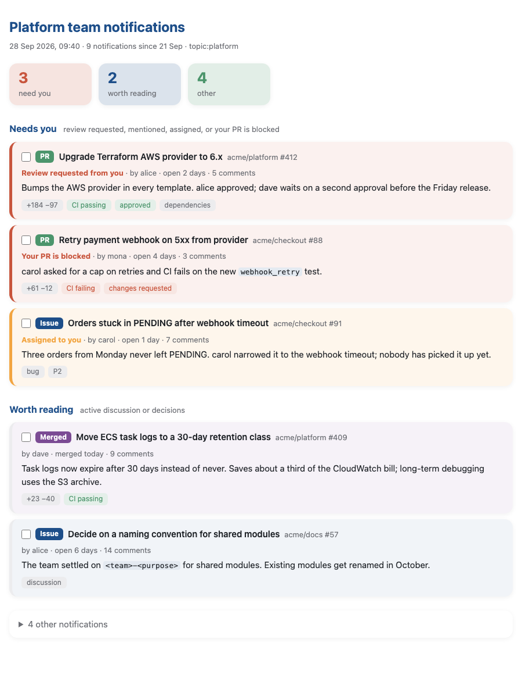
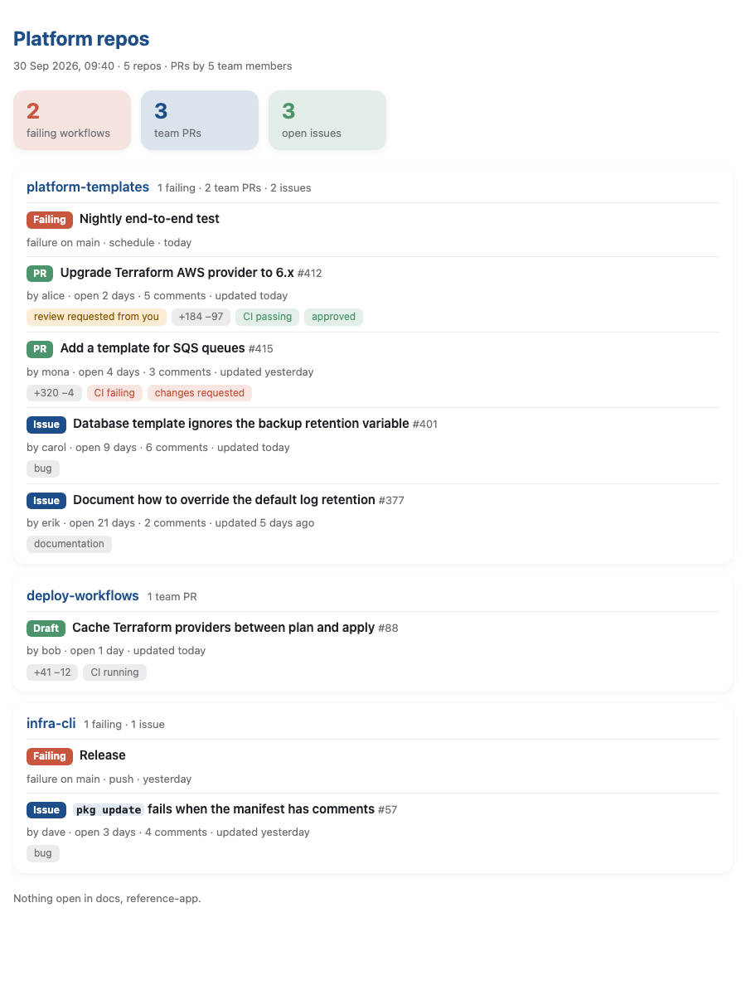

# my-skills

Skills I find useful that don't necessarily belong together. They share one plugin so I don't have to install a new plugin every time I add a skill.

## Install

```
/plugin marketplace add yngvark/claude-plugins
/plugin install my-skills@yngvark
```

## Skills

### notification-summary

Summarizes the most important GitHub issues and PRs in your notifications into an HTML page in a temp dir, and opens it. The page starts with a few highlights of what to do now. Threads are sorted into "Needs you", "Worth reading" and a collapsed list of the rest, each with a short summary of where it stands.



Pass a `github.com/notifications?query=...` URL or its query, or set a default:

```sh
export NOTIFICATION_SUMMARY_QUERY="topic:my-team author:alice author:bob"
```

Supported terms are `topic:`, `author:`, `repo:`, `org:`, `reason:`, `is:unread`, `is:pr` and `is:issue`. Needs the `gh` CLI, logged in.

### repo-watch

Builds a page per repository with the workflows whose latest run on the default branch failed, open PRs by your team, and all open issues. Dependency-update PRs never show up, because only PRs by the listed authors do. Unlike notification-summary, it shows what is open now, not what notified you.



Configure it in `~/.config/my-skills/repo-watch.toml`, or point `$REPO_WATCH_CONFIG` at another file:

```toml
title = "Platform"
authors = ["alice", "bob"]
repos = ["acme/platform", "acme/docs"]
```

Needs the `gh` CLI, logged in, with SSO authorized for the orgs you list.

## Development

```sh
make test
```
